# Store Provisioning Platform

A Kubernetes-native platform for provisioning and managing isolated e-commerce stores. Users create fully functional WooCommerce stores via a React dashboard, each running in its own namespace with complete order-to-checkout capability.

## Architecture

```
                        +-------------------+
                        |  React Dashboard  |
                        |  (Vite + NGINX)   |
                        +--------+----------+
                                 | HTTP
                        +--------v----------+
                        | Node.js Backend   |
                        | Express + SQLite  |
                        +--------+----------+
                                 | @kubernetes/client-node
                   +-------------v--------------+
                   |      Kind / k3s Cluster     |
                   |                             |
    +--------------+---+   +--------------+---+  |
    | store-myshop NS  |   | store-demo NS   |  |
    | +-- MySQL        |   | +-- MySQL        |  |
    | +-- WordPress/WC |   | +-- WordPress/WC |  |
    | +-- Ingress      |   | +-- Ingress      |  |
    | +-- NetworkPolicy|   | +-- NetworkPolicy|  |
    | +-- ResourceQuota|   | +-- ResourceQuota|  |
    | +-- LimitRange   |   | +-- LimitRange   |  |
    | +-- Secrets      |   | +-- Secrets      |  |
    +------------------+   +------------------+  |
                   +-----------------------------+
```

**Tech Stack:**
| Component | Technology |
|-----------|-----------|
| Frontend | React 18 + TypeScript + Vite, served by NGINX |
| Backend | Node.js + Express + TypeScript |
| State DB | SQLite (better-sqlite3), PVC-backed |
| K8s Client | `@kubernetes/client-node` (programmatic, not kubectl/helm subprocess) |
| Validation | Zod schema validation |
| Queue | p-queue (concurrency-controlled provisioning) |
| Local K8s | Kind (3-node cluster) |
| Ingress | NGINX Ingress Controller + nip.io wildcard DNS |
| Packaging | Helm 3 charts with values-local / values-prod |

## Screenshots

### Dashboard (Light Mode) - Multiple Stores with Provisioning Queue
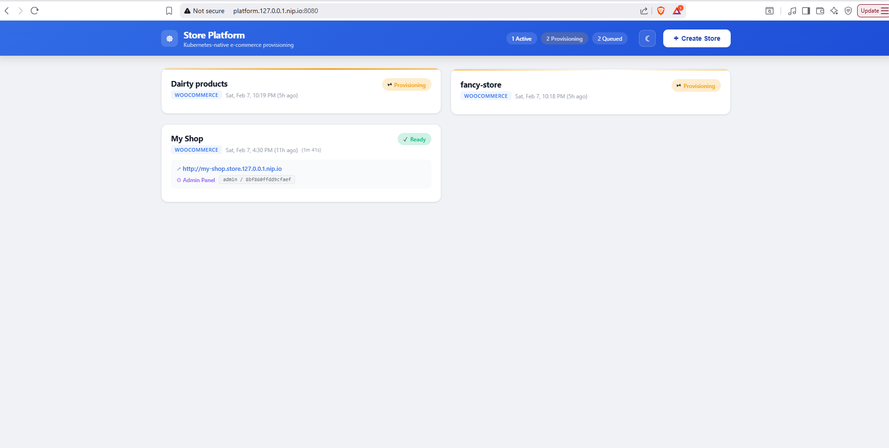

### Dashboard (Dark Mode) - Multiple Stores Ready
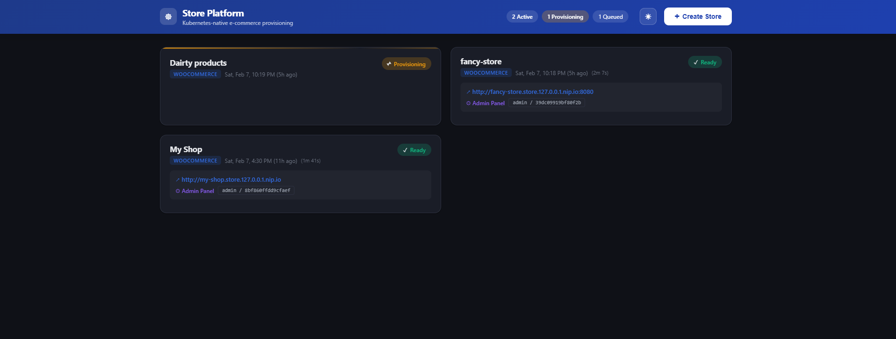

### Provisioning Timeline - Step-by-Step Progress
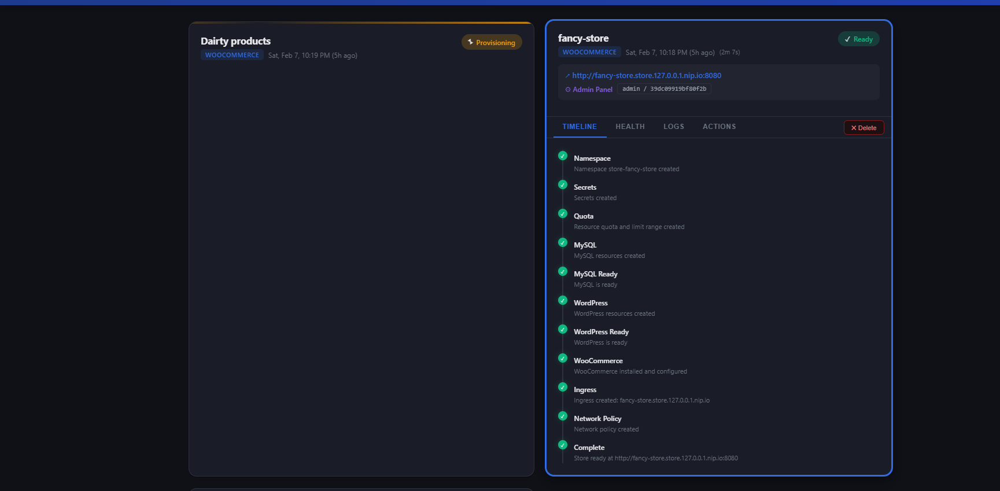

### Health Tab - Pod Metrics, Storage, Resource Quota
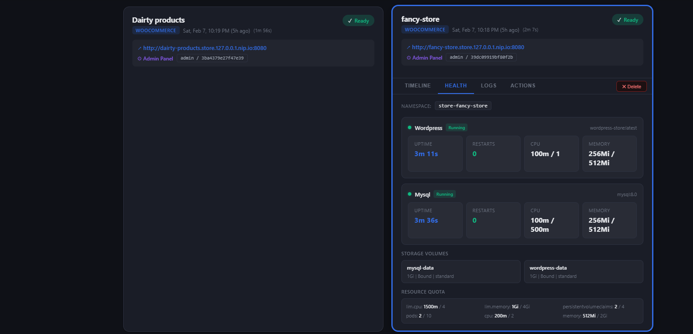

### Logs Tab - Real-time Pod Log Viewer
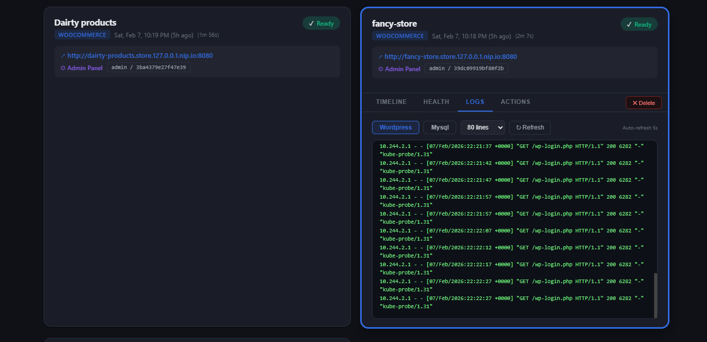

### Actions Tab - Restart Pods, Reset Password
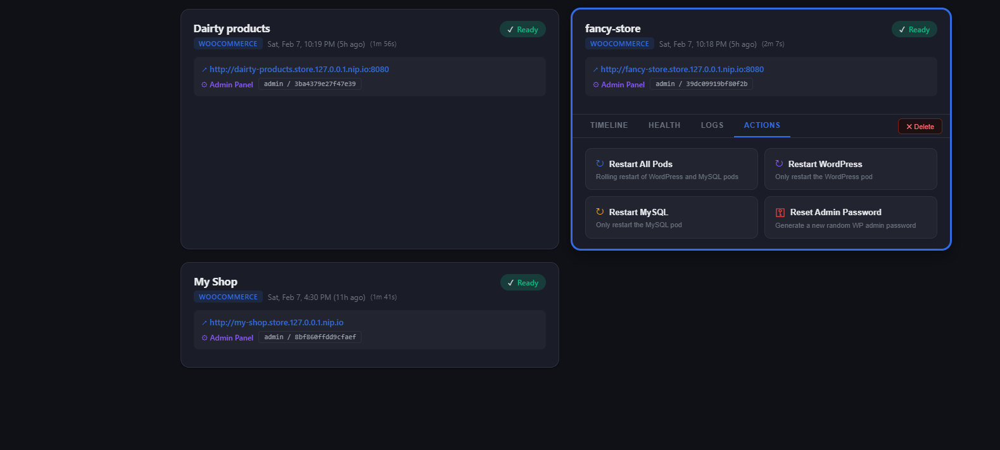

### WooCommerce Store - Shop Page with Product
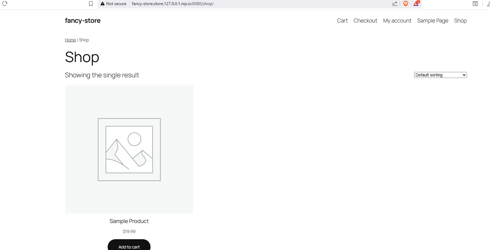

### Shopping Cart
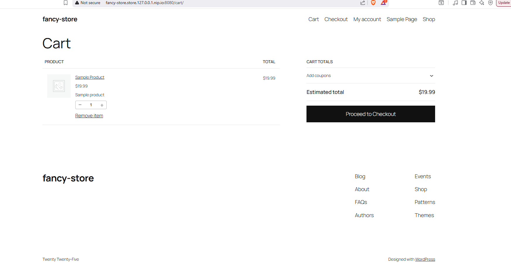

### Checkout Page (Cash on Delivery)
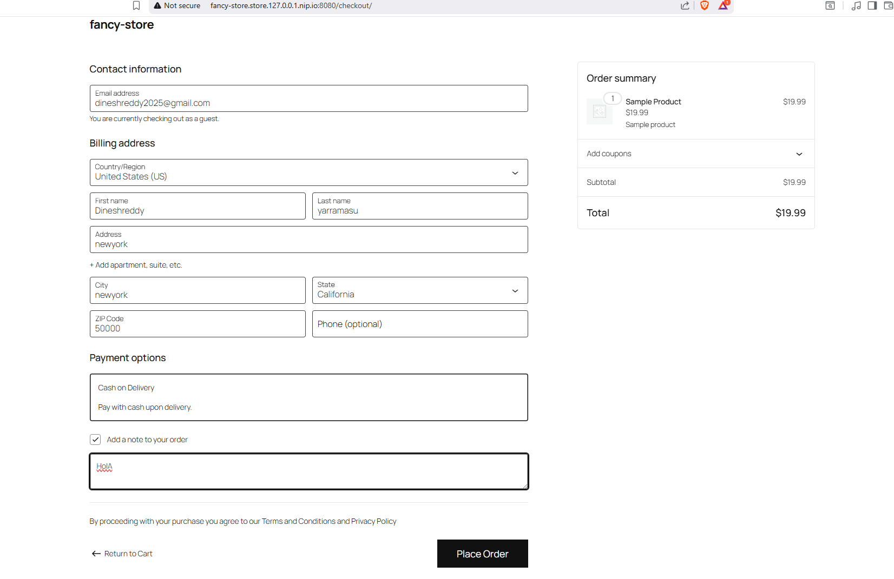

### Order Received - Confirmation
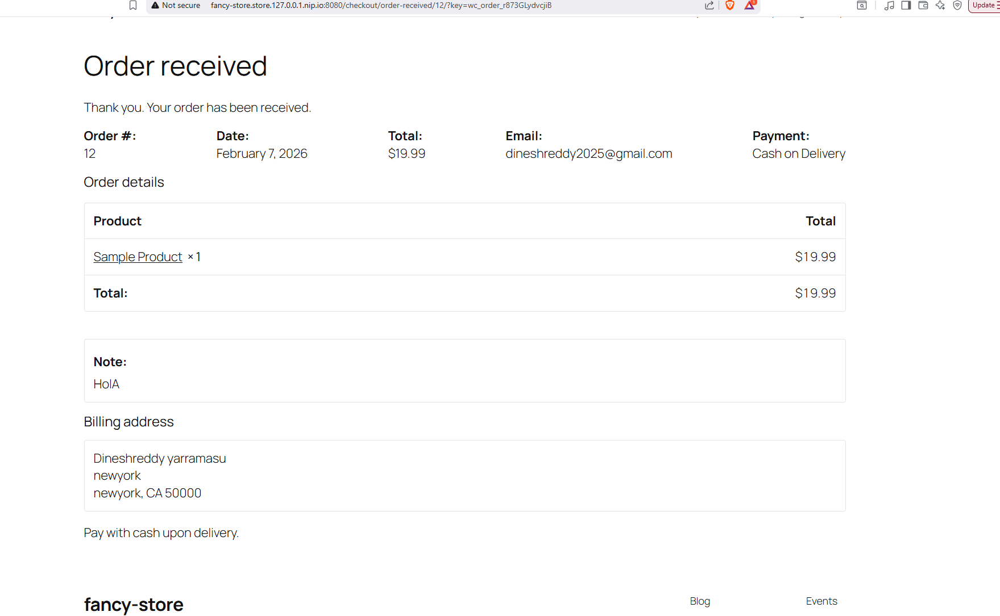

### WordPress Admin Login
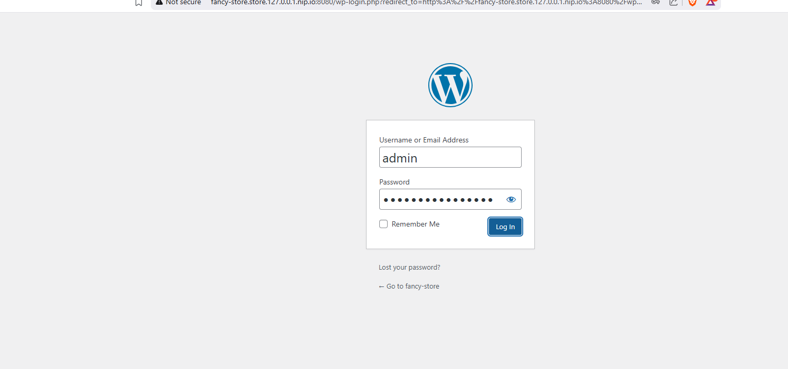

### WooCommerce Admin - Orders List
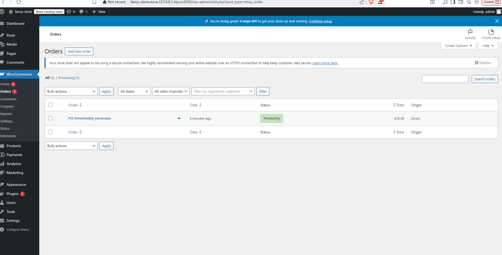

## Prerequisites

- **Docker Desktop** with WSL2/Hyper-V backend
- **Node.js** 20+
- **Kind** (`choco install kind` or [manual install](https://kind.sigs.k8s.io))
- **Helm 3** (`choco install kubernetes-helm` or [manual install](https://helm.sh/docs/intro/install/))
- **kubectl** (`choco install kubernetes-cli` or [manual install](https://kubernetes.io/docs/tasks/tools/))

## Local Setup (Kind)

### 1. Create the Kind cluster + Ingress

```bash
bash infrastructure/kind/setup.sh
```

Creates a 3-node cluster (1 control-plane + 2 workers) with port mappings for HTTP/HTTPS and installs the NGINX Ingress Controller.

### 2. Build Docker images

```bash
cd backend && npm install && cd ..
cd frontend && npm install && cd ..
bash infrastructure/scripts/build-images.sh
```

### 3. Load images into Kind

```bash
bash infrastructure/scripts/load-images.sh
```

### 4. Deploy the platform

```bash
bash infrastructure/scripts/deploy-platform.sh
```

### 5. Access the dashboard

**Dashboard:** http://platform.127.0.0.1.nip.io

> **Note:** If port 80 is blocked on your machine, use `kubectl port-forward svc/store-platform-frontend 8080:80 -n store-platform` and access via `http://platform.127.0.0.1.nip.io:8080`

### Quick commands (Makefile)

```bash
make setup      # Create Kind cluster + ingress
make build      # Build Docker images
make load       # Load images into Kind
make deploy     # Deploy platform via Helm
make all        # Full setup (all of the above)
make teardown   # Delete Kind cluster
make clean      # Teardown + remove images
```

## How to Create a Store and Place an Order

### Create a Store

1. Open the dashboard
2. Click **"+ Create New Store"**
3. Enter a store name (e.g., "My Test Shop") and admin email
4. Select **WooCommerce** as the engine
5. Click **Create Store**
6. Watch real-time provisioning timeline: Namespace -> Secrets -> MySQL -> WordPress -> WooCommerce -> Ingress -> NetworkPolicy -> Ready

### Place an Order (End-to-End)

1. Click the **store URL** on the dashboard (e.g., `http://my-test-shop.store.127.0.0.1.nip.io`)
2. A sample product "Sample Product" ($19.99) is pre-created
3. Click **Add to Cart**
4. Proceed to **Checkout**
5. Fill in billing details (any test data works)
6. Select **Cash on Delivery** as payment method
7. Click **Place Order** - Order confirmed!

### Verify in WooCommerce Admin

1. Click the **Admin Panel** link on the dashboard
2. Login with the credentials shown (`admin / <generated-password>`)
3. Navigate to **WooCommerce > Orders** - your order is visible

### Delete a Store

1. Click the **Delete** button on the store card
2. Confirm deletion
3. All K8s resources are cascade-deleted via namespace deletion (pods, PVCs, secrets, ingress, network policies)

## Dashboard Features

| Feature | Description |
|---------|-------------|
| **Store Management** | Create, view, delete stores with real-time status |
| **Provisioning Timeline** | Step-by-step progress of each provisioning stage |
| **Health Monitoring** | Pod metrics (uptime, restarts, CPU/memory), PVC info, resource quota usage |
| **Real-time Pod Logs** | Terminal-style log viewer with pod selector and auto-refresh |
| **One-Click Actions** | Restart pods (all/wordpress/mysql), reset admin password |
| **Audit Log** | Platform-wide activity trail with action, resource, IP address, timestamps |
| **Dark/Light Mode** | Theme toggle with persistent preference |
| **Exact Timestamps** | Store creation time with relative display (e.g., "Sat, Feb 7, 7:36 PM (2h ago)") |

## VPS/Production Setup (k3s)

### 1. Install k3s on VPS

```bash
curl -sfL https://get.k3s.io | sh -
export KUBECONFIG=/etc/rancher/k3s/k3s.yaml
```

### 2. Install Helm

```bash
curl https://raw.githubusercontent.com/helm/helm/main/scripts/get-helm-3 | bash
```

### 3. Build and push images to a registry

```bash
docker tag store-platform-backend:local ghcr.io/yourorg/store-platform-backend:1.0.0
docker tag store-platform-frontend:local ghcr.io/yourorg/store-platform-frontend:1.0.0
docker push ghcr.io/yourorg/store-platform-backend:1.0.0
docker push ghcr.io/yourorg/store-platform-frontend:1.0.0
```

### 4. Deploy with production values

```bash
kubectl create namespace store-platform

helm upgrade --install store-platform helm/store-platform \
  --namespace store-platform \
  -f helm/store-platform/values.yaml \
  -f helm/store-platform/values-prod.yaml \
  --set global.storeDomain=store.yourdomain.com \
  --set global.platformDomain=platform.yourdomain.com \
  --wait
```

### 5. DNS Setup

Create wildcard DNS records pointing to your VPS IP:
```
*.store.yourdomain.com  ->  VPS_IP
platform.yourdomain.com ->  VPS_IP
```

### 6. TLS (Optional - cert-manager)

```bash
kubectl apply -f https://github.com/cert-manager/cert-manager/releases/latest/download/cert-manager.yaml
```

TLS is pre-configured in `values-prod.yaml` with Let's Encrypt integration. Once cert-manager is installed and DNS is configured, certificates are automatically issued.

## System Design & Tradeoffs

### Architecture Choice

**Direct K8s API** via `@kubernetes/client-node` instead of shelling out to `kubectl` or `helm`:
- Type-safe resource definitions
- Better error handling (HTTP status codes, 409 conflict detection)
- No subprocess overhead
- Programmatic control over resource creation order and wait conditions

**SQLite** for platform state instead of PostgreSQL:
- Zero infrastructure overhead (file-based, PVC-backed)
- Perfect for single-instance orchestrator
- Migration system with versioned schema changes
- Trade-off: not suitable for multi-instance backend without switching to PostgreSQL

**Strategy Pattern** for store engines:
- `StoreProvisioner` interface with `provision(store)` method
- `WooCommerceProvisioner` - fully implemented
- `MedusaProvisioner` - stubbed with architecture documentation
- Adding a new engine = implement one class, register in factory

### Idempotency & Failure Handling

Every K8s resource creation catches **409 Conflict** and treats it as success:
```typescript
try {
  await coreApi.createNamespace(buildNamespace(namespace, id));
} catch (err: any) {
  if (err?.response?.statusCode === 409) {
    // Already exists - idempotent success
  } else throw err;
}
```

This means:
- Store creation is **safe to retry** - no duplicate resources
- If the backend crashes mid-provisioning, re-triggering picks up where it left off
- Each step is logged to the `provisioning_events` table for visibility
- Failed stores get `status=Failed` with the error message preserved

**Cleanup guarantee**: Deleting the namespace cascades to all child resources (Deployments, PVCs, Services, Secrets, Ingress, NetworkPolicy). The backend waits for namespace termination before removing the DB record.

### Isolation & Security

| Mechanism | What It Does |
|-----------|-------------|
| **Namespace-per-store** | Complete resource isolation between stores |
| **NetworkPolicy** | Deny-by-default ingress; allow only from ingress-nginx namespace + intra-namespace traffic |
| **ResourceQuota** | Per-namespace limits: 2 CPU req / 4 CPU limit, 2Gi mem req / 4Gi mem limit, 10 pods, 4 PVCs |
| **LimitRange** | Default container resources (100m-500m CPU, 256Mi-512Mi mem), max PVC 5Gi |
| **RBAC** | Backend ServiceAccount with ClusterRole scoped to exact verbs needed (least privilege) |
| **Secrets** | Per-store passwords generated via `crypto.randomBytes`, stored only in K8s Secrets |
| **Non-root containers** | Backend runs as `node` user with `tini` init process |
| **Helmet** | HTTP security headers on all API responses |

### Abuse Prevention

| Control | Implementation |
|---------|---------------|
| **Rate limiting** | `express-rate-limit`: 5 store creates/min, 10 actions/min per IP |
| **Max store quota** | Configurable `MAX_STORES` limit (default: 10), returns 429 when exceeded |
| **Input validation** | Zod schemas with regex, length, email validation on store creation |
| **Provisioning timeout** | Configurable timeout (default: 300s) for WooCommerce init |
| **Concurrency control** | p-queue limits parallel provisioning (default: 3 concurrent) |
| **Audit trail** | Every create/delete/restart/reset action logged with IP, timestamp, resource details |

### Horizontal Scaling Plan

| Component | Scales? | How |
|-----------|---------|-----|
| **Frontend (NGINX)** | Horizontally | Stateless SPA, increase replicas |
| **Backend API** | Horizontally* | Stateless request handling; provisioning queue is in-memory per instance |
| **SQLite** | Vertically only | Single-writer limitation; swap to PostgreSQL for multi-instance |
| **Store namespaces** | Independently | Each store is isolated; K8s scheduler distributes across nodes |

*For true horizontal scaling of the backend, replace SQLite with PostgreSQL and use a distributed queue (Redis/BullMQ) instead of in-memory p-queue.

### Upgrade & Rollback

```bash
# Upgrade platform
helm upgrade store-platform helm/store-platform \
  -n store-platform \
  -f helm/store-platform/values.yaml \
  -f helm/store-platform/values-prod.yaml

# Rollback on failure
helm rollback store-platform -n store-platform

# View history
helm history store-platform -n store-platform
```

Store WordPress/MySQL images can be upgraded per-store by patching deployments, or globally by updating Helm values and re-provisioning.

### What Changes for Production

| Concern | Local (Kind) | Production (k3s/VPS) |
|---------|-------------|---------------------|
| Domain | `*.127.0.0.1.nip.io` | `*.store.yourdomain.com` |
| Images | `imagePullPolicy: Never` | `Always` (from registry) |
| Storage class | `standard` | `longhorn` / cloud storage |
| Storage size | 1Gi | 5-10Gi |
| TLS | Disabled | cert-manager + Let's Encrypt |
| Replicas | 1 | 2+ (HA) |
| Resources | Minimal | Production-grade |
| Log level | `debug` | `warn` |
| Concurrency | 3 | 5+ |

All differences are handled via Helm values files only - **zero code changes** between local and production.

## API Endpoints

| Method | Endpoint | Description |
|--------|----------|-------------|
| GET | `/api/stores` | List all stores + queue size |
| GET | `/api/stores/:id` | Get store details |
| POST | `/api/stores` | Create store (rate-limited) |
| DELETE | `/api/stores/:id` | Delete store + cascade cleanup |
| GET | `/api/stores/:id/events` | Provisioning timeline events |
| GET | `/api/stores/:id/health` | Pod metrics, PVC info, quota usage |
| GET | `/api/stores/:id/logs/:pod` | Real-time pod logs |
| POST | `/api/stores/:id/actions/restart` | Restart pods (rate-limited) |
| POST | `/api/stores/:id/actions/reset-password` | Reset WP admin password (rate-limited) |
| GET | `/api/audit` | Audit trail of all actions |
| GET | `/healthz` | Liveness probe |
| GET | `/readyz` | Readiness probe (checks DB) |

## Database Schema

```sql
-- Platform state
stores (id, name, slug, namespace, status, plan, url, admin_url,
        admin_email, admin_password, error_message, created_at, provisioned_at)

-- Step-by-step provisioning visibility
provisioning_events (id, store_id, step, status, message, created_at)

-- Audit trail
audit_log (id, action, resource_type, resource_id, resource_name, details, ip_address, created_at)
```

## Project Structure

```
K8/
├── frontend/                     # React + Vite + TypeScript
│   ├── src/
│   │   ├── api/                  # Axios client, store/audit API calls
│   │   ├── types/                # TypeScript interfaces
│   │   ├── App.tsx               # Full dashboard (themes, tabs, health, logs, actions)
│   │   └── main.tsx
│   ├── Dockerfile                # Multi-stage: Node build -> NGINX serve
│   └── nginx.conf                # SPA fallback + /api proxy to backend
│
├── backend/                      # Node.js + Express + TypeScript
│   ├── src/
│   │   ├── routes/               # stores.ts (CRUD + health/logs/actions), health.ts
│   │   ├── services/
│   │   │   ├── provisioningService.ts   # p-queue orchestration
│   │   │   ├── cleanupService.ts        # Namespace cascade deletion
│   │   │   └── provisioners/            # Strategy pattern
│   │   │       ├── index.ts             # Interface + factory
│   │   │       ├── woocommerceProvisioner.ts  # Full implementation
│   │   │       └── medusaProvisioner.ts       # Stub
│   │   ├── k8s/
│   │   │   ├── client.ts                # K8s API client initialization
│   │   │   ├── resourceBuilder.ts       # All K8s resource definitions
│   │   │   └── secretGenerator.ts       # Crypto-based secret generation
│   │   ├── db/
│   │   │   ├── connection.ts            # SQLite connection
│   │   │   ├── migrate.ts              # Versioned migrations
│   │   │   └── repositories/           # Store, event, audit repos
│   │   ├── middleware/                  # Error handler
│   │   └── config.ts                   # Environment-driven configuration
│   └── Dockerfile                      # Multi-stage + non-root + tini
│
├── helm/
│   ├── store-platform/                 # Platform Helm chart
│   │   ├── values.yaml                 # Base values
│   │   ├── values-local.yaml           # Kind overrides
│   │   ├── values-prod.yaml            # Production overrides (k3s/VPS)
│   │   └── templates/                  # Deployments, Services, Ingress, RBAC, PVC
│   └── woocommerce-store/              # Per-store reference chart
│       └── templates/                  # MySQL, WordPress, Ingress, NetworkPolicy
│
├── infrastructure/
│   ├── kind/
│   │   ├── kind-config.yaml            # 3-node cluster config
│   │   ├── setup.sh                    # Cluster + ingress setup
│   │   └── teardown.sh                 # Cluster deletion
│   └── scripts/
│       ├── build-images.sh             # Docker build
│       ├── load-images.sh              # kind load
│       └── deploy-platform.sh          # helm install
│
├── INTERVIEW-GUIDE.md                  # Detailed walkthrough for interview
├── Makefile                            # Quick commands
├── .env.example                        # Environment template
└── .gitignore
```
